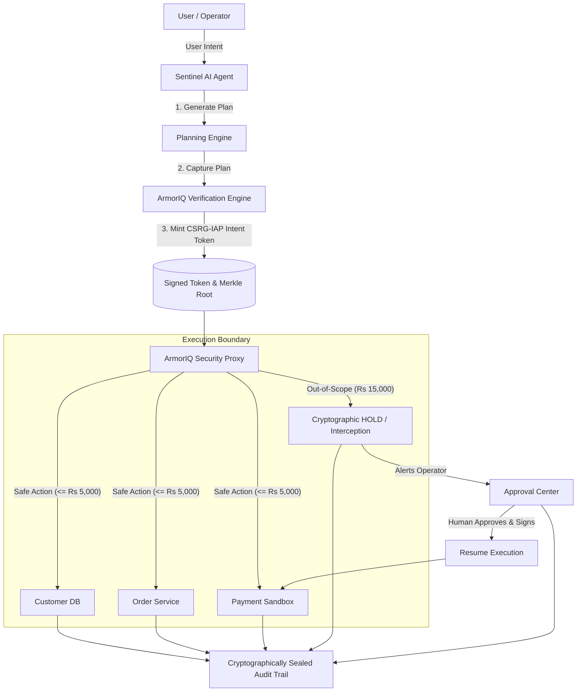

# 🛡️ SENTINEL AI

> **"Autonomy with a Boundary."**
> 
> *Enterprise AI Agent Security & Cryptographic Intent Authorization Platform*  
> **Automate India Hackathon Grand Finale — ArmorIQ Track (Problem 1: "Autonomous, until it shouldn't be")**

---

## ⚡ Executive Summary

Autonomous AI agents possess unprecedented power to query databases, calculate complex refund logic, and invoke payment settlement APIs. However, unconstrained autonomy introduces severe risks of **intent drift, prompt injection, and catastrophic financial loss**.

Traditional guards rely on naive regex matching or post-hoc heuristics that are easily bypassed. **SENTINEL AI** introduces **cryptographic intent authorization** powered by **ArmorIQ**:
1. Before taking action, the agent's multi-step plan is canonicalized and hashed into a **SHA-256 Merkle Tree**.
2. ArmorIQ mints a tamper-evident **Intent Token (`CSRG-IAP`)** binding the agent strictly to its authorized boundary (e.g. `maxRefundLimit ≤ ₹5,000`).
3. Every tool invocation passes through the **ArmorIQ Verification Proxy**.
4. When an out-of-scope action occurs (e.g. attempting a ₹15,000 refund), ArmorIQ **blocks the call before it ever touches sandbox systems**, placing it in cryptographic **HOLD**.
5. A human supervisor reviews the security diff and grants explicit authorization, enabling the agent to safely resume and seal an immutable audit trail.

---

## 🏗️ Architecture Overview



---

## 🚀 Key Features

* **Real ArmorIQ Enforcement**: Built with `@armoriq/sdk`, implementing `capturePlan()`, `getIntentToken()`, and proxy `invoke()`.
* **Zero Leakage Guarantee**: The underlying payment sandbox will **never** execute an unauthorized transaction during a block.
* **Input-Driven Platform**: Operators enter natural language instructions, dynamically extract intent, and evaluate runtime limits.
* **Cinematic Live Hero UI**: Built with React 19, Tailwind CSS, and Framer Motion, featuring glowing cyber-mesh panels, live telemetry streams (SSE), and interactive state transitions.
* **Human-in-the-Loop Approval Center**: Side-by-side risk differential inspector (Authorized limit vs Attempted disbursement) with single-click cryptographic resume.
* **Immutable Audit Trail**: SHA-256 sealed ledger capturing every plan creation, step invocation, security hold, and supervisor decision.
* **Zero-Setup Offline Resilience**: Runs against ArmorIQ cloud proxy when `ARMORIQ_API_KEY` is provided, or uses the embedded zero-dependency local verifier for 100% demo reliability anywhere.

---

## 🛠️ Technology Stack

| Layer | Technologies |
| :--- | :--- |
| **Frontend** | React 19, TypeScript, Vite, Tailwind CSS, Framer Motion, Lucide React, Axios |
| **Backend** | Node.js, TypeScript, Express, Server-Sent Events (SSE), SQLite3 |
| **Security & SDK** | `@armoriq/sdk`, SHA-256 Merkle Tree Engine, CSRG-IAP Token Minting |
| **Sandboxed Tools** | Customer Database MCP, Order Service MCP, Payment Gateway Sandbox, Notification Dispatcher |
| **Testing** | Vitest, Supertest |

---

## 🏁 Quickstart & Installation

### 1. Prerequisites
- **Node.js** v18+ (tested on Node v24.19 LTS)
- **npm** v9+

### 2. Clone & Install
```bash
git clone https://github.com/aadi10pandey/armorq-ai.git
cd armorq-ai

# Install root dependencies
npm install

# Install backend dependencies
cd backend && npm install

# Install frontend dependencies
cd ../frontend && npm install
cd ..
```

### 3. Run the Development Servers
In two separate terminals:

**Terminal 1 (Backend):**
```bash
cd backend
npm run dev
# Backend runs on http://localhost:4000
```

**Terminal 2 (Frontend):**
```bash
cd frontend
npm run dev
# Frontend runs on http://localhost:5173
```

### 4. Run Automated Test Suite
```bash
cd backend
npm test
```
*Runs all 5 boundary enforcement tests verifying safe autonomous actions, out-of-scope holds, human resumption, rejection, and idempotency.*

---

## 🎮 3-Minute Hackathon Demo Script

1. **Open the Dashboard**: Go to `http://localhost:5173`.
2. **Phase 1: Safe Autonomous Work**:
   - Type `"Process the refund for customer Priya Sharma for order ORD-8821 if eligible."`
   - Watch the agent verify records and disburse ₹4,200 autonomously without human intervention.
3. **Phase 2: Out-of-Scope Interception**:
   - Type `"Refund order #4821 for customer Anita Desai (amount: ₹15,000)."`
   - Watch the UI trigger the **🛡️ AUTHORITY BOUNDARY REACHED** state, halting before touching payment systems.
4. **Phase 3: Human Approval & Ledger Audit**:
   - Click **`[ APPROVE & CONTINUE ]`**.
   - Watch the hold release, sandbox payment settle, and the SHA-256 cryptographic audit seal finalize.

---

## 📜 License & Acknowledgments

Built for the **Automate India Hackathon Grand Finale — ArmorIQ Track**.  
Powered by **ArmorIQ Cryptographic Intent Authorization**.
