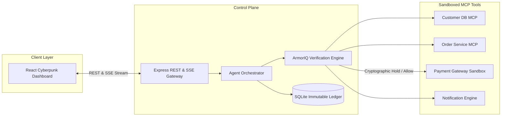

# SENTINEL AI Architecture Specification

## 1. System Overview

SENTINEL AI is structured as a decoupled, high-performance control plane combining:
- A reactive TypeScript backend with native ArmorIQ cryptographic proxy integration.
- An SQLite database abstraction for state, plans, transactions, and immutable audit logs.
- A futuristic React frontend utilizing Server-Sent Events (SSE) for sub-millisecond telemetry visualization.

## 2. Core Subsystems

### A. AI Planning & Orchestration
- Generates structured, declarative step sequences for assigned user goals.
- Canonicalizes inputs and hashes parameters into deterministically ordered payloads.
- Emits real-time state transitions at every micro-step.

### B. ArmorIQ Cryptographic Verification Engine
- Mints `CSRG-IAP` intent tokens containing authorized limits, Merkle roots, and actor scopes.
- Evaluates invocations against declared policies.
- Automatically places out-of-scope invocations into `HOLD`, preventing underlying execution until human confirmation.

### C. Financial Sandbox Ledger
- Implements idempotent transaction processing (`idempotencyKey`).
- Validates double-spend prevention.
- Records settlement references and links approved transactions back to supervisor approval IDs.
